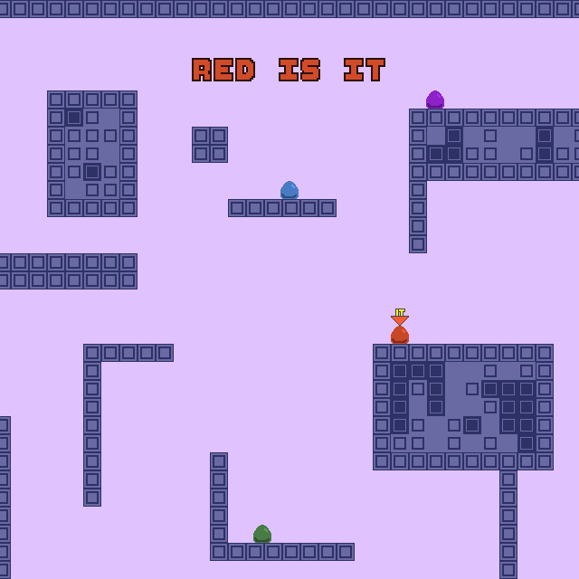

# Tag

Author: Alton Olson

Design: A fast-paced platformer where you try to tag your friends.

Networking: The client handles all the input and movement for one player, and transmits a small packet with the location of the player every frame. When a player falls into the pit, a one-byte packet is transmitted.

Screen Shot:

How To Play:

Arrow keys to move, space to jump. You can slide on walls and wall-jump. Regular rules of tag. Tag-backs are allowed. If nobody is 'it' you can start the game by falling down the pit at the bottom of the level (this respawns you and makes you 'it').

Sources: N/A

This game was built with [NEST](NEST.md).

